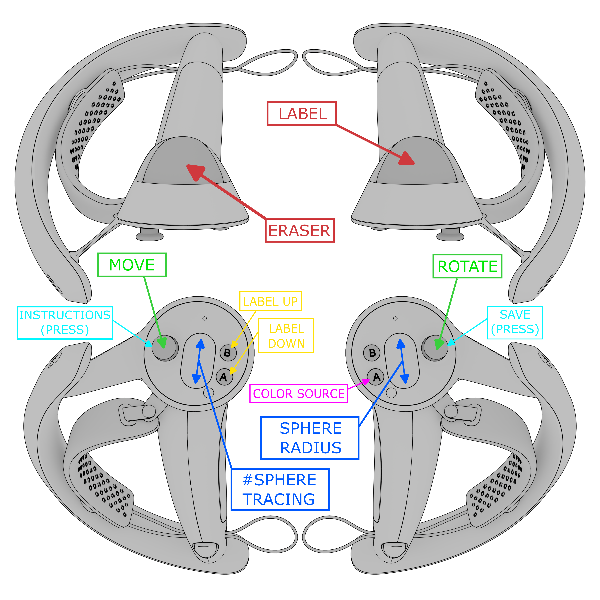

# Spheriactus

## Table of Contents


- [Installation](#installation)
- [Introduction](#introduction)
- [Instructions](#instructions)
  - [Getting Started](#getting-started)
  - [About the Tool](#about-the-tool)
  - [Supported File Formats](#supported-file-formats)
  - [Output Files](#output-files)
  - [Importing Labelled Point Clouds](#importing-labelled-point-clouds)
  - [Controller Buttons Overview](#controller-buttons-overview)
  - [Vertical Locomotion](#vertical-locomotion)
- [Sphere Tracing Explained](#sphere-tracing-explained)
- [Limitations](#limitations)
- [Tips](#tips)
- [License](#license)

## Installation

1. Install **Unreal Engine 5.5**.
2. Install **SteamVR** and ensure it is properly configured for your VR setup.
3. Clone this repository and initialise submodules:
      ```
      git clone --branch 5.5-public --recurse-submodules https://github.com/DLR-MI/spheriactus.git
      # Or, if you've already cloned:
      git submodule update --init --recursive
      ```
4. Open the project file [`Spheriactus.uproject`](Spheriactus.uproject).  
   Unreal Engine will rebuild the modules automatically.  
   - **Tip:** You can monitor the process in the logs at:  
     `.\Spheriactus\Saved\Logs\Spheriactus.log`.

## Introduction

Welcome to the **VR Point Cloud Labelling Tool**! This application enables intuitive and immersive interaction with large-scale 3D point clouds using a VR headset and controllers. Designed for researchers and professionals working with spatial data, the tool allows users to manually label individual points or regions in a point cloud with ease. Whether working with architectural scans, environmental mapping, or industrial datasets, this tool is built to handle point clouds of millions of points and adapt to diverse datasets.

Key features:

    - Immersive Interaction: Use VR controllers to navigate, highlight, and label points directly in a 3D environment.
    - Scalable Processing: Efficiently handle point clouds with millions of points.

Let's get started!

## Instructions

### Getting Started  
1. **Set Up:** Connect your VR setup to your PC, ensuring that Unreal Engine is installed.
2. **Launch:** Run the program.
3. **Import:** Select the point cloud file you wish to use.
4. **Configure Labels:** Add pairs of text and colours for the labels you’ll use during the labelling process.
5. **Load Point Cloud:** Wait for the point cloud to be imported and for collision data to be built.
6. **Tutorial:** Follow the tutorial to familiarise yourself with the tool's features.
7. **Start Labelling:** You’re ready to label!

---

### About the tool 
This tool uses a customised version of the [Lidar Point Cloud Plugin](https://dev.epicgames.com/documentation/en-us/unreal-engine/lidar-point-cloud-plugin-for-unreal-engine) for Unreal Engine. This plugin enables importing, visualising, and interacting with large-scale point clouds in real-time.

### Supported File Formats
The tool supports **ASCII-encoded point clouds in `.txt` format**. Here's an example of a correctly formatted `.txt` file with three points (header is optional):
| x     | y     | z     | r     | g     | b     |
|---    |---    |---    |-----  |---    |-----  |
| 0     | 1     | 0     | 255   | 0     | 0     |
| 1     | 1     | 0     | 255   | 0     | 255   |
| 0     | 1     | 1     | 255   | 0     | 0     |

### Output Files  
When saving a labelled point cloud, the tool creates a new file in the same directory as the original, with the same filename and the suffix `_labelled`. For example:  
| x     | y     | z     | r     | g     | b     | label_id  | label_name    |
|---    |---    |---    |-----  |---    |-----  |---------- |------------   |
| 0     | 1     | 0     | 255   | 0     | 0     | 0         | "floor"       |
| 1     | 1     | 0     | 255   | 0     | 255   | 1         | "table"       |
| 0     | 1     | 1     | 255   | 0     | 0     | 0         | "floor"       |


- **label_name:** The label text chosen in the labelling dialog.
- **label_id:** A unique index for each label.

### Importing Labelled Point Clouds  
When importing a previously labelled point cloud, labels will appear with their respective `label_name` and default label colours. If additional labels are required, you can add them through the labels dialog. The default label colour map supports seven entries; add more as needed.

### Controller Buttons Overview  
This program was developed and tested using the **Valve Index VR Kit**, and the provided controller diagram refers to **Valve Index Controllers**. If you use a different VR kit, some buttons or features may map differently or not work.  
<div align="center">
  
</div>  

**Labelling:**  
- Hold the **Label button** while performing sweeping motions with the right controller.  
- Points currently highlighted by sphere tracing will be assigned the selected label as you "paint" over them in real time.  

**Erasing Labels:**  
- Hold the **Eraser button** while performing sweeping motions with the right controller.  
- Highlighted points will have their labels removed in real time.  

**Sphere Radius & Number of Traces:**  
- Use the designated buttons to adjust the **selection area**.  
- The tool relies on [sphere tracing](#sphere-tracing-explained) to highlight points.  
  - Increasing the **Sphere Radius** enlarges each trace's influence area.  
  - Increasing the **# Sphere Tracing** adds more secondary traces, broadening coverage.

**Colour Source Modes:**  
- **Data with Classification Alpha:** Displays points with their original colours when unlabelled. After labelling, points adopt their respective label colour.
- **Classification:** Unlabelled points appear white, while labelled points retain their label colour (useful for spotting unlabelled points).

### Vertical Locomotion  
Look up or down to move vertically.  
**Note:** While moving vertically, labelling is disabled. Similarly, vertical movement is disabled during labelling.  

## Sphere Tracing Explained  
  

The tool performs sphere tracing to detect and label points. Here’s a quick breakdown:
1. A primary sphere trace is cast in the direction of the right controller.  
2. If a collision is detected, a sphere is placed at the hit location, highlighting all points inside.  
3. Additional (secondary) traces are performed in a hexagonal pattern around the hit location for broader coverage. 
4. Increasing **Sphere Radius** enlarges the selection area of each sphere.  
5. Increasing **# Sphere Tracing** (number of sphere traces) adds more secondary traces (useful for increasing highlighted surface area).  


## Limitations  
- **Point Limit:** Works with point clouds up to **150 million points.**
- **File Format:** Compatible with `.txt` files.
- **Labelled Point Clouds:** Imported labelled point clouds may display different label schemes. In the label dialog, make sure to create the same labels as the ones used in the imported labelled point cloud.
- **VR Compatibility:** Developed and tested exclusively with the **Valve Index VR Kit**. Compatibility with other VR kits has not been verified and may require additional setup or adjustments.
- **Blocking Operations:** Import and export run on the main thread. Depending on point cloud size and system performance, the editor may appear unresponsive for **5–10 minutes** during these operations.
- **Collision Building:** After import, collision data is built using a latent process. During this time the editor remains responsive (you can look around the scene) but **asset loading is deferred until collision building completes**, so expect another wait.
- **Error Feedback:** Import errors may not always be clearly surfaced in the UI. Check the **Unreal Engine output log** for details if an import seems to fail.
- **Sparse Point Clouds:** Labelling interaction based on sphere tracing is less precise on sparse point clouds. The tool performs best with **denser point clouds**, where sweeping motions highlight surfaces more consistently.

## Tips  
- **Test with small files first:** Try importing a small point cloud before attempting larger datasets to verify your setup.
- **Monitor the output log:** Always keep the **Unreal Engine Output Log** open during import/export to catch warnings or errors early.
- **Be patient with large imports:** For very large point clouds, imports, exports, and collision building may take several minutes. The editor may look frozen (this is expected).
- **Label consistency:** When working with labelled point clouds, make sure to recreate labels with the same names and colours used in the imported file to avoid mismatches.
- **Prefer denser point clouds:** For smoother labelling and erasing with sphere tracing, use denser datasets whenever possible.
- **Controller orientation matters (multi-sphere tracing):** The labelling experience feels more natural when the controller is aimed **perpendicularly to the surface**. In this orientation, secondary sphere traces distribute more evenly across the surface, producing a denser and more consistent selection. At oblique angles, secondary traces are projected more sparsely, which can make the selection feel less continuous.

## License
[(Back to top)](#table-of-contents)

Project compliant with version 3.3 of the [REUSE Specification](https://reuse.software/spec-3.3/). Please have a look at the [TOML Configuration file](REUSE.toml) and [LICENSES folder](LICENSES) for more details.
